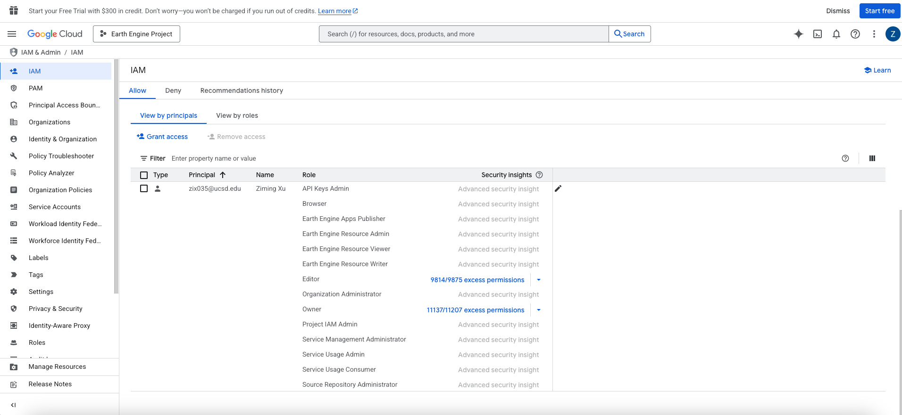

# Google Earth Engine Thin Client

A Django web application for browsing, searching, and downloading data from Google Earth Engine.

## 📚 Documentation

For detailed information about the project architecture, file structure, and implementation details, see:

**[📖 Comprehensive Project Documentation](COMPREHENSIVE_PROJECT_DOCUMENTATION.md)**

This comprehensive guide includes:

- Complete project overview and system architecture
- Detailed directory structure analysis
- Critical files breakdown and code analysis
- Configuration and deployment information
- Database design and API documentation
- Frontend and backend implementation details

---

## Prerequisites

- Python 3.12.4
- Google Earth Engine account with authentication
- Google Cloud Project with Earth Engine API enabled

## Installation

1. Clone the repository:

```bash
git clone https://github.com/Thrcle421/thin-client-for-google-earth-engine.git
cd thin-client-for-google-earth-engine
```

2. Create a virtual environment:

There are several ways to create a Python virtual environment depending on your operating system and preferences:

### Using venv (built-in Python module)

```bash
# Create the virtual environment
python -m venv venv

# Activate the virtual environment
# On Windows:
venv\Scripts\activate
# On macOS and Linux:
source venv/bin/activate
```

### Using conda (if you have Anaconda or Miniconda installed)

If Anaconda is not installed, you can install it with these commands:

```bash
# Download Anaconda installer
curl -O https://repo.anaconda.com/archive/Anaconda3-2023.09-0-MacOSX-x86_64.sh

# Install Anaconda (non-interactive mode)
bash Anaconda3-2023.09-0-MacOSX-x86_64.sh -b

# Initialize conda for zsh
~/anaconda3/bin/conda init zsh

# Reload shell configuration
source ~/.zshrc

# Verify installation
conda --version && python --version
```

Once Anaconda is installed:

```bash
# Create the virtual environment
conda create -n earthengine-env python=3.12.4

# Activate the virtual environment
# On Windows, macOS, and Linux:
conda activate earthengine-env
```

### Using virtualenv (requires installation)

```bash
# Install virtualenv if not already installed
pip install virtualenv

# Create the virtual environment
virtualenv venv

# Activate the virtual environment
# On Windows:
venv\Scripts\activate
# On macOS and Linux:
source venv/bin/activate
```

To deactivate the virtual environment when you're done, simply run:

```bash
deactivate  # For venv and virtualenv
# OR
conda deactivate  # For conda environments
```

3. Install dependencies:

```bash
pip install -r requirements.txt
```

4. Set up the database and load data:

```bash
# Step 1: Create database migrations
python manage.py makemigrations

# Step 2: Apply migrations to the database
python manage.py migrate

# Step 3: Load Earth Engine dataset catalog
python manage.py load_gee_catalog
```

## Google Earth Engine Authentication

1. Install the Earth Engine CLI:

```bash
pip install earthengine-api
```

2. Authenticate with Earth Engine:

```bash
earthengine authenticate
```

3. Initialize Earth Engine with your project ID:

Visit https://code.earthengine.google.com/ and find your project ID in the settings.

## Running the Application

Start the development server:

```bash
python manage.py runserver
```

## Google Cloud IAM Permissions

You need to configure proper permissions for your Google Earth Engine service account:

1. Visit the [Google Cloud IAM Admin console](https://console.cloud.google.com/iam-admin/)
2. Select your project
3. Add the necessary permissions as shown in the reference image (`image.png` in the project root)
4. Ensure your service account has access to the Earth Engine API


